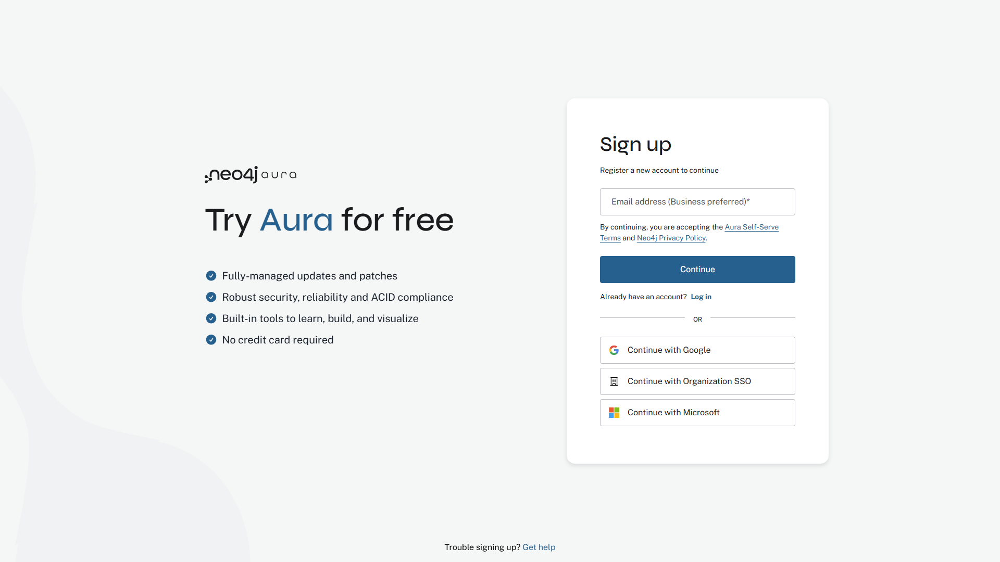
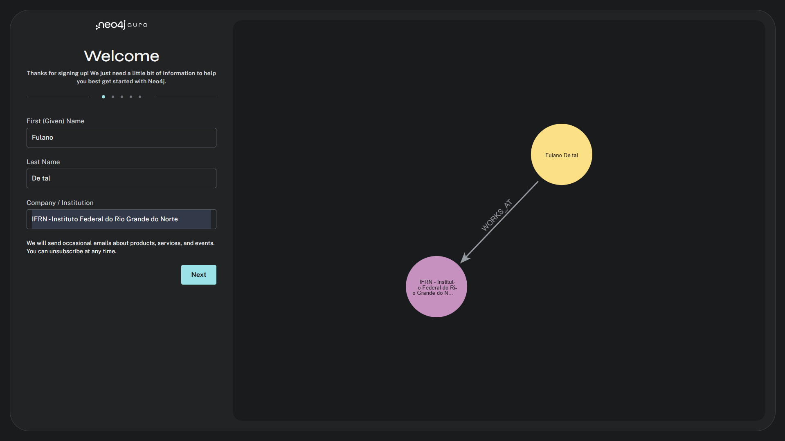
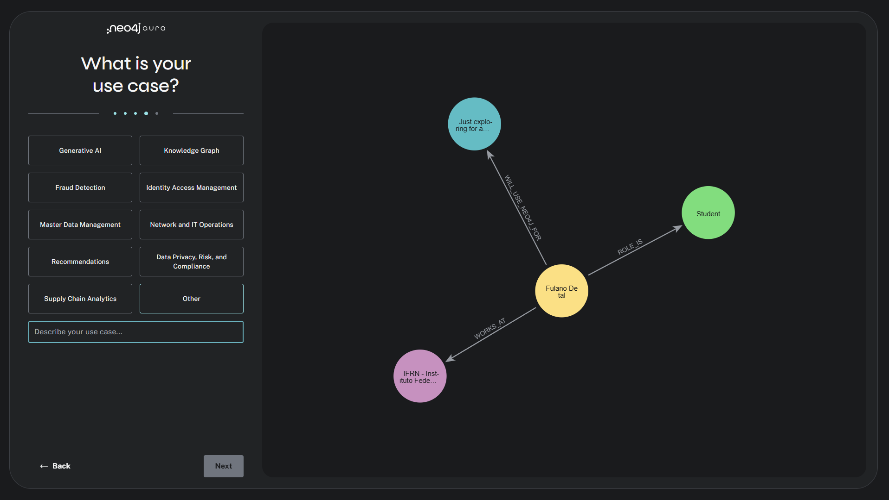
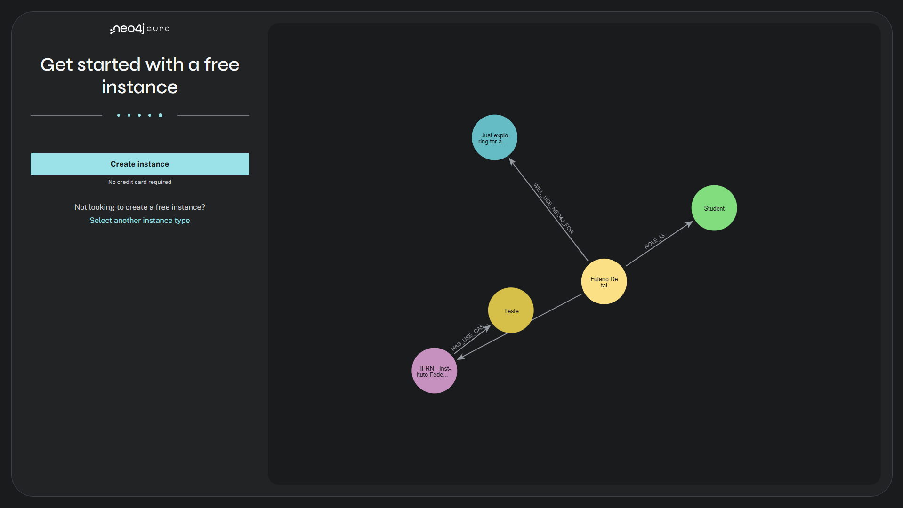
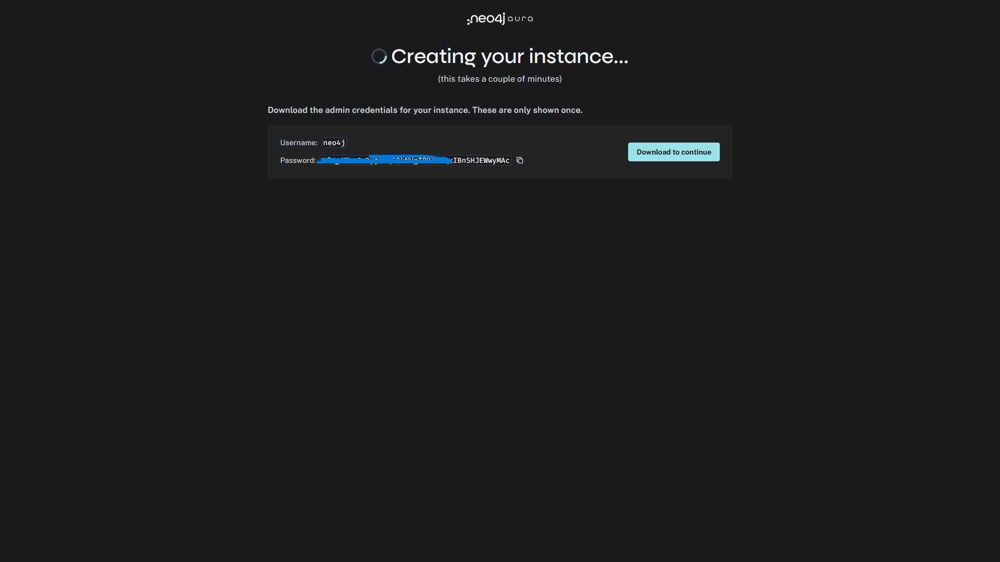
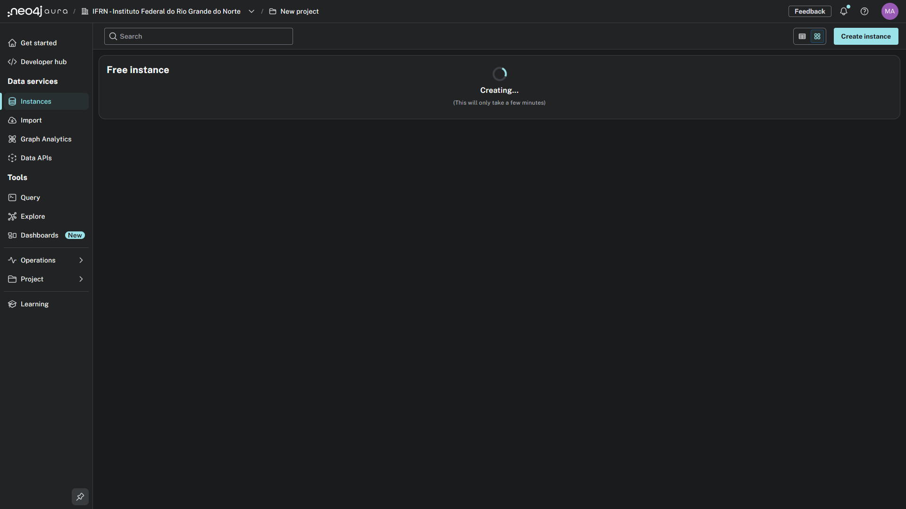
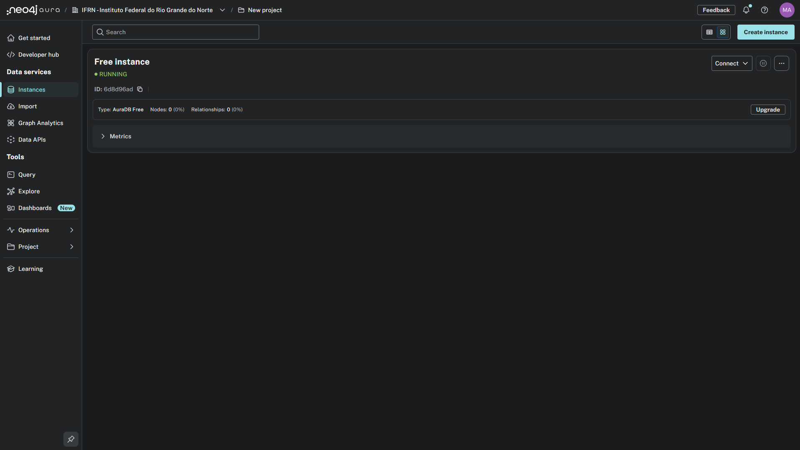
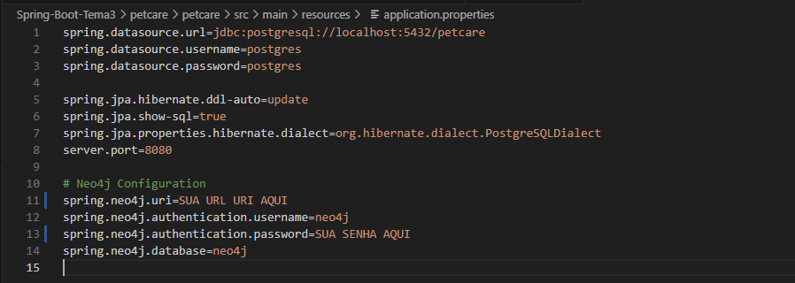
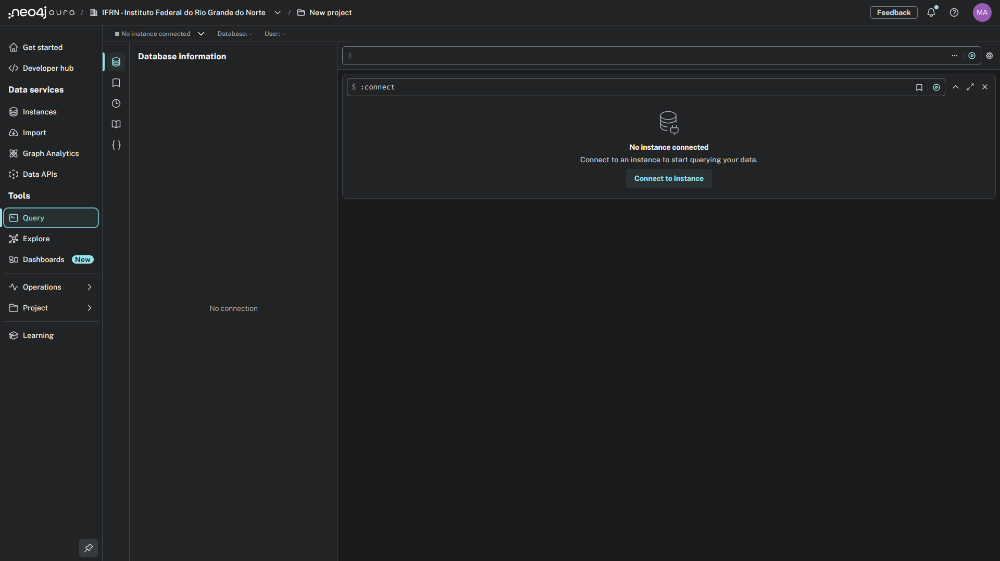

## 🛠 Pré-requisitos

Antes de começar, certifique-se de ter instalado:

### Software Necessário
- **Java 17+** - [Download](https://adoptium.net/)
- **PostgreSQL 12+** - [Download](https://www.postgresql.org/download/)
- **Neo4j Desktop** - [Download](https://neo4j.com/deployment-center/?gdb-selfmanaged&community)
- **Python 3.8+** - [Download](https://www.python.org/downloads/)
- **Git** - [Download](https://git-scm.com/)

## 🚀 Instalação

### 1. Clone o Repositório

git clone <url-do-repositorio>
cd petcare/petcare

## 🗄️ Configuração do Banco de Dados

### PostgreSQL

#### 1. Criar Banco de Dados

Realize a criação de um banco de dados chamado petcare pelo PGADMIN. Mantenha o usuario e senha postgres para não necessitar trocar nas configurações.

### Neo4j

# Guia de Configuração do Neo4j AuraDB

Este guia irá demonstrar o passo a passo para criar uma instância gratuita do banco de dados Neo4j AuraDB e configurar este projeto para se conectar a ela, utilizando as imagens de referência do nosso diretório.

## Passo 1: Acesse o Site Oficial do Neo4j

Acesse o site [Neo4j.com](https://neo4j.com/) e clique em um dos botões de início, como "Get Started Free" ou "Start Building", para começar o processo.

## Passo 2: Inicie o Cadastro na Plataforma Aura

Na página seguinte, inicie o seu cadastro para o Neo4j Aura. Você pode usar seu e-mail ou um método de login social como o do Google.

## Passo 3: Preencha suas Informações de Perfil

Após a primeira etapa do cadastro, complete seu perfil com seu nome, sobrenome e a instituição à qual você pertence.

## Passo 4: Responda ao Questionário de Uso

A plataforma fará um breve questionário para entender como você planeja usar o Neo4j. Selecione as opções que melhor se aplicam ao seu caso.

## Passo 5: Confirme a Criação da Instância Gratuita

Após o questionário, você será direcionado para a tela final de criação. Clique no botão **"Create instance"** para iniciar o provisionamento do seu banco de dados.

## Passo 6: Aguarde o Provisionamento

A plataforma começará a criar sua instância na nuvem. Este processo pode levar alguns instantes.

## Passo 7: Salve Suas Credenciais (ETAPA CRUCIAL)

Durante a criação, suas credenciais de acesso serão exibidas. **Esta é a ÚNICA OPORTUNIDADE para ver e salvar sua senha (`Password`).** Copie e guarde o `Username` e a `Password` em um local seguro.

## Passo 8: Confirme que a Instância está Ativa

Após salvar as credenciais, a plataforma finalizará a configuração. Aguarde até que o status da sua instância mude para **RUNNING**, indicando que ela está online e pronta para uso.

## Passo 9: Configure o `application.properties` do Projeto

Com as credenciais salvas, abra o projeto na sua IDE e navegue até o arquivo `src/main/resources/application.properties`. Preencha os campos `spring.neo4j.uri`, `spring.neo4j.authentication.username` e `spring.neo4j.authentication.password` com os dados da sua instância.

## Passo 10: Conecte-se ao Banco de Dados no Navegador

Para interagir com seu banco de dados, volte ao painel do Neo4j Aura, clique na aba **"Query"** no menu lateral e, em seguida, clique no botão **"Connect to instance"** para ativar o console.

Com estes 10 passos, seu ambiente está totalmente configurado e pronto para executar a aplicação.

## ▶️ Executando o Projeto

### 1. Configurar application.properties

Verifique se o arquivo src/main/resources/application.properties está correto de acordo com as credenciais que você criou:

spring.datasource.url=jdbc:postgresql://localhost:5432/petcare
spring.datasource.username=postgres
spring.datasource.password=postgres

spring.jpa.hibernate.ddl-auto=update
spring.jpa.show-sql=true
spring.jpa.properties.hibernate.dialect=org.hibernate.dialect.PostgreSQLDialect

server.port=8080

spring.neo4j.uri=bolt://localhost:7687
spring.neo4j.authentication.username=neo4j
spring.neo4j.authentication.password=neo4j
spring.neo4j.database=neo4j

### 2. Compilar e Executar

#### Windows:

./mvnw.cmd spring-boot:run

### 3. Verificar se Subiu
- **API**: http://localhost:8080
- **Swagger**: http://localhost:8080/swagger-ui.html

## 📊 Populando o Banco

# Instalar dependências Python

python -m venv venv
cd ./venv/Scripts/activate
pip install requests, faker

# Executar script de popular o banco
python scripts/populate_database.py

**Dados criados:**
- 3 tutores
- 2 veterinários
- 5 pets
- 4 medicamentos
- 3 atendimentos

## 🔄 Sistema de Backup Neo4j

### Como Funciona
O sistema sincroniza automaticamente dados do PostgreSQL para o Neo4j, criando um backup em formato de grafo.

### Executar Backup Manual

#### Via Swagger:
1. Acesse: http://localhost:8080/swagger-ui.html
2. Vá em **backup-controller**
3. Execute **POST** /api/backup/full

## 📡 API Endpoints

### Entidades Principais
- **Pets**: /api/pets
- **Tutores**: /api/tutores
- **Veterinários**: /api/veterinarios
- **Atendimentos**: /api/atendimentos
- **Medicamentos**: /api/medicamentos
- **Cirurgias**: /api/cirurgias
- **Clínicas**: /api/clinicas

### Backup
- **Backup Completo**: POST /api/backup/full
- **Status**: GET /api/backup/status
- **Limpar**: DELETE /api/backup/clear

### Operações CRUD
Todas as entidades suportam:
- **GET** /api/{entidade} - Listar todos
- **GET** /api/{entidade}/{id} - Buscar por ID
- **POST** /api/{entidade} - Criar novo
- **PUT** /api/{entidade}/{id} - Atualizar
- **DELETE** /api/{entidade}/{id} - Deletar

---